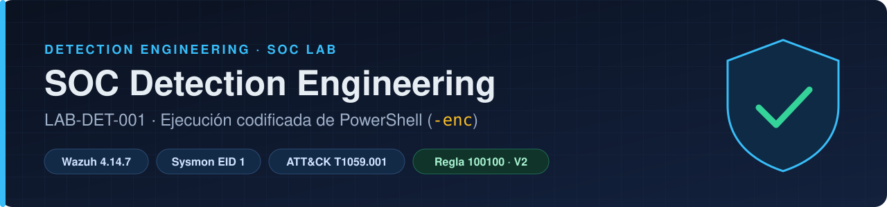
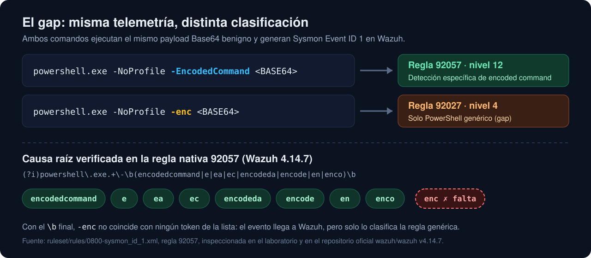
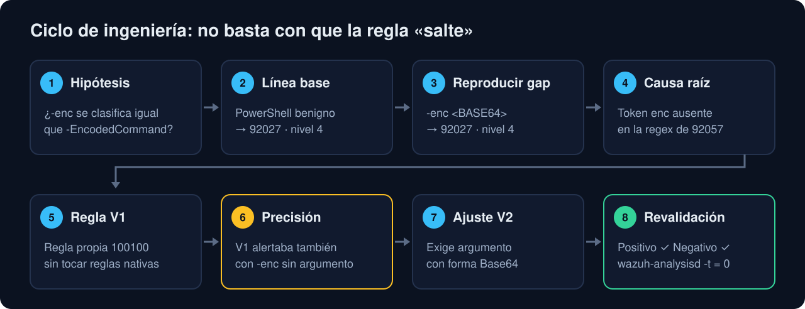
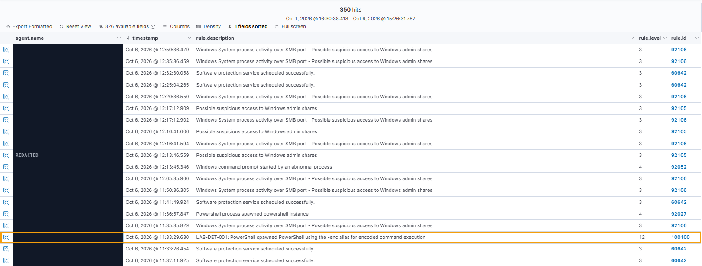
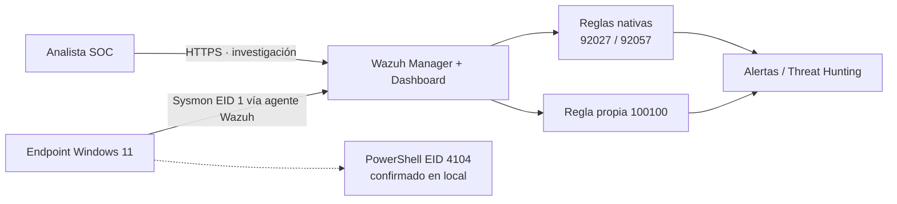

<p align="center">
  
</p>

<p align="center">
  <a href="https://github.com/CarlosGutierrezR/soc-detection-engineering/actions/workflows/detection-tests.yml"></a>
  
  
  
  
  
  <a href="LICENSE"></a>
</p>

<p align="center">
  <b>Proyecto práctico de ingeniería de detección sobre un laboratorio SOC propio.</b><br>
  Encontré un hueco de cobertura en una regla nativa de Wazuh, identifiqué la causa exacta en su expresión regular,<br>
  diseñé una regla propia, detecté un problema de precisión y lo corregí con pruebas positivas y negativas.
</p>

<p align="center">
  <a href="#-resumen-en-60-segundos">Resumen</a> ·
  <a href="#-el-problema">Problema</a> ·
  <a href="#-la-solución">Solución</a> ·
  <a href="#-resultados">Resultados</a> ·
  <a href="#-evidencia-y-reproducibilidad">Evidencia</a> ·
  <a href="#-alcance-y-limitaciones">Limitaciones</a> ·
  <a href="#-english-summary">English</a>
</p>

---

## ⚡ Resumen en 60 segundos

| Aspecto | Detalle |
|---|---|
| **Pregunta** | Si un atacante usa `-enc` (alias corto) en lugar de `-EncodedCommand`, ¿Wazuh lo detecta igual? |
| **Hallazgo** | **No.** La telemetría llega completa, pero `-enc` solo recibe la regla genérica `92027` (nivel 4) en vez de la específica `92057` (nivel 12). |
| **Causa raíz** | La expresión regular de la regla nativa `92057` no incluye el token `enc`. Verificado en el laboratorio y en el código oficial de Wazuh 4.14.7. |
| **Solución** | Regla propia `100100` (nivel 12), sin modificar las reglas del fabricante, con copia de seguridad y plan de reversión. |
| **Calidad** | La V1 alertaba también con `-enc` vacío → se ajustó a V2, que exige un argumento con forma Base64. Revalidada con un positivo y un negativo. |
| **Honestidad** | Validado en laboratorio controlado. No se afirma cobertura universal ni una tasa de falsos positivos de producción. |

### ¿Por dónde empezar?

| Si eres… | Lee esto |
|---|---|
| 👔 **Reclutador / RR. HH.** | Este README (2–3 min) y la sección [Competencias demostradas](#-competencias-demostradas). |
| 🛡️ **Analista o ingeniero de detección** | [Caso de estudio completo](docs/LAB-DET-001-case-study.md) → [regla](detection-rules/wazuh-rules.xml) → [matriz de cobertura](docs/coverage-matrix.md) → [evidencia](evidence/README.md). |
| 🔬 **Revisor técnico exigente** | [Entorno y versiones](docs/environment.md), [análisis del ruleset oficial](docs/upstream-review.md), [plan V3](docs/v3-research-plan.md) y [limitaciones](docs/limitations.md). |

---

## 🎯 El problema

PowerShell permite ejecutar código codificado en Base64 con `-EncodedCommand` o con abreviaturas como `-enc`. Es una técnica habitual para ocultar comandos ([MITRE ATT&CK T1059.001](https://attack.mitre.org/techniques/T1059/001/)).

En el laboratorio, ambos comandos ejecutaron **el mismo payload benigno** y generaron el mismo evento Sysmon en Wazuh, pero la clasificación fue distinta:

<p align="center">
  
</p>

> **Conclusión clave:** no era un problema de *visibilidad* (los datos estaban), sino de *calidad de detección* (la lógica no los clasificaba bien).

---

## 🔧 La solución

Se creó una regla propia en `/var/ossec/etc/rules/`, **sin editar el ruleset nativo** (que se sobrescribe al actualizar Wazuh):

```xml
<group name="local,windows,sysmon,lab_det_001,">
  <rule id="100100" level="12">
    <if_group>sysmon_event1</if_group>
    <field name="win.eventdata.parentImage" type="pcre2">(?i)\\powershell\.exe$</field>
    <field name="win.eventdata.commandLine" type="pcre2">(?i)powershell\.exe.*\s-enc\s+[A-Za-z0-9+/]{8,}={0,2}(?:\s|$)</field>
    <description>LAB-DET-001: PowerShell spawned PowerShell using the -enc alias for encoded command execution</description>
    <mitre>
      <id>T1059.001</id>
    </mitre>
  </rule>
</group>
```

| Condición | Por qué |
|---|---|
| `if_group sysmon_event1` | Usa el evento de creación de procesos de Sysmon (Event ID 1). |
| `parentImage = powershell.exe` | **Paridad intencionada** con la regla nativa `92057`, que tiene el mismo filtro. Es un límite de alcance, no una afirmación de que otros padres sean benignos. |
| `-enc` + argumento con forma Base64 (≥ 8 caracteres) | Evita el problema de precisión de la V1 (ver resultados). |
| Nivel 12 | El mismo nivel que la detección nativa equivalente (`92057`). |

**Controles de cambio aplicados:** inventario de reglas propias existentes, ID libre (`100100`), copia de seguridad del directorio, `wazuh-analysisd -t` con código de salida `0`, reinicio controlado del manager y comprobación `active`.

---

## 🔁 Ciclo de ingeniería

<p align="center">
  
</p>

---

## ✅ Resultados

| Caso | Comando | Resultado en Wazuh | Interpretación |
|---|---|---|---|
| TC-00 | PowerShell normal | `92027` · nivel 4 | Línea base: `92027` no prueba detección de encoded command |
| TC-01 | `-EncodedCommand <BASE64>` | `92057` · nivel 12 | ✅ Cobertura nativa correcta |
| TC-02 | `-enc <BASE64>` (sin regla propia) | `92027` · nivel 4 | ❌ **Gap reproducido** |
| TC-02-R1 | `-enc <BASE64>` con V1 | `100100` · nivel 12 | ✅ Gap corregido |
| NEG-V1 | `-enc` sin argumento con V1 | `100100` · nivel 12 | ⚠️ Coincidencia demasiado amplia |
| TC-02-V2 | `-enc <BASE64>` con V2 | `100100` · nivel 12 | ✅ **PASS** |
| NEG-V2 | `-enc` sin argumento con V2 | `92027` · nivel 4, sin `100100` | ✅ **PASS** |

> **Sobre NEG-V1:** un `-enc` vacío puede seguir siendo sospechoso. El problema era semántico: una regla que afirma «ejecución codificada» no debe dispararse cuando no hay payload codificado.

**Prueba real en Wazuh (TC-02-V2, datos operativos ocultos):**

<p align="center">
  
</p>

Matriz de referencia: [docs/coverage-matrix.md](docs/coverage-matrix.md) · Procedimientos: [tests/test-cases.md](tests/test-cases.md)

---

## 🧱 Arquitectura



El laboratorio está segmentado con pfSense y reutiliza un SOC permanente. Detalle: [docs/architecture.md](docs/architecture.md) · Versiones: [docs/environment.md](docs/environment.md)

---

## 🔎 Evidencia y reproducibilidad

| Elemento | Estado |
|---|---|
| [Alerta real de Wazuh saneada — gap nativo (TC-02, JSON)](evidence/lab-det-001/tc02-native-alert-sanitized.json) | ✅ Publicada |
| [Alerta real de Wazuh saneada — regla 100100 (TC-02-V2, JSON)](evidence/lab-det-001/tc02-v2-custom-alert-sanitized.json) | ✅ Publicada |
| Capturas reales con datos ocultos: [línea de comandos](evidence/lab-det-001/screenshots/e6-v2-positive-commandline.png) · [campos de la regla](evidence/lab-det-001/screenshots/e7-v2-positive-rule-fields.png) · [lista de alertas](evidence/lab-det-001/screenshots/e7-v2-positive-alert-list.png) | ✅ Publicadas |
| [Procedencia de la evidencia](evidence/README.md) | ✅ Documentada |
| CI en GitHub Actions: XML bien formado + pruebas PCRE2 positivas, negativas y de límites de V2 | ✅ En verde |
| [Análisis de incoherencias del ruleset oficial (92057 vs 92059/92071)](docs/upstream-review.md) | ✅ Documentado |
| Salidas de `wazuh-logtest` | 🕒 Pendiente |
| Versión exacta de PowerShell (`$PSVersionTable`) | 🕒 Pendiente |

Las capturas se publican recortadas y con los identificadores operativos ocultos (IPs, nombres de equipo, usuario, GUIDs, hashes); las originales no se publican. Los SVG de `evidence/` son resúmenes visuales, no sustituyen a la evidencia primaria.

---

## 🧭 Alcance y limitaciones

<details>
<summary><b>Ver limitaciones (resumen)</b></summary>

- Validado con un conjunto pequeño y controlado: **1 positivo y 1 negativo** en la aceptación final de V2.
- No hay tasa de falsos positivos de producción ni periodo prolongado de observación de actividad normal.
- V2 cubre el alias exacto `-enc`. Otras abreviaturas (`-encod`, `-encodedc`…), `/enc`, argumentos entre comillas o guiones Unicode **quedan fuera** y se investigan en V3.
- Solo cubre PowerShell lanzado desde `powershell.exe` (paridad con `92057`).
- La comprobación Base64 es heurística: valida la forma, no decodifica.
- El resultado depende de la versión: hay que revisarlo tras cada actualización de Wazuh.

Lista completa: [docs/limitations.md](docs/limitations.md)
</details>

---

## 🚀 Próximos pasos

- [x] Reproducir el gap y verificar la causa raíz en la regla instalada
- [x] Regla V2 validada con pruebas positivas y negativas
- [x] CI con pruebas de contrato PCRE2 y límites documentados
- [ ] Capturar salidas reproducibles con `wazuh-logtest`
- [ ] Validar en el endpoint qué abreviaturas acepta realmente PowerShell (V3)
- [ ] Observar actividad normal durante un periodo prolongado para medir ruido
- [ ] Reportar el hallazgo al proyecto oficial de Wazuh tras superar los criterios de [upstream-review](docs/upstream-review.md)

---

## 💼 Competencias demostradas

| Competencia | Dónde se ve |
|---|---|
| Distinguir visibilidad de calidad de detección | Telemetría presente, clasificación incorrecta |
| Método de pruebas con línea base | TC-00 antes de interpretar cualquier alerta |
| Análisis de causa raíz sobre la configuración real | Inspección de la regex de `92057` |
| Gestión segura de cambios | Copia de seguridad, validación, reversión, sin tocar reglas nativas |
| Ajuste de precisión (*tuning*) | V1 → V2 tras una prueba negativa |
| Mapeo MITRE ATT&CK | T1059.001 |
| Automatización y regresión | GitHub Actions + PCRE2 |
| Comunicación técnica honesta | Limitaciones y pendientes declarados explícitamente |

---

## 📁 Estructura del repositorio

```text
.
├── assets/                  gráficos del README
├── detection-rules/         regla Wazuh 100100 (V2)
├── docs/                    caso de estudio, entorno, limitaciones, plan V3
├── evidence/                procedencia y evidencia saneada
├── tests/                   procedimientos de prueba y pruebas de contrato PCRE2
└── .github/workflows/       CI (XML + PCRE2)
```

---

## 🌐 English summary

**LAB-DET-001** is a hands-on detection engineering case built on a reusable SOC lab (Wazuh 4.14.7, Sysmon, Windows 11).

- **Finding:** PowerShell `-EncodedCommand` triggered native Wazuh rule `92057` (level 12), while the equivalent `-enc` alias only triggered generic rule `92027` (level 4). Telemetry was present; classification was not.
- **Root cause:** rule `92057`'s PCRE2 alternation does not include the `enc` token (verified in the lab and in the official Wazuh v4.14.7 ruleset).
- **Fix:** custom rule `100100` (level 12) without modifying vendor rules; V1 over-matched an empty `-enc`, V2 requires a Base64-looking argument and passed positive and negative revalidation.
- **Scope:** lab-validated only; no production false-positive rate is claimed. Broader prefix coverage (V3) and `wazuh-logtest` captures are tracked as open work.

Start with the [full case study](docs/LAB-DET-001-case-study.md).

---

## 🔐 Seguridad y publicación

Todos los payloads son benignos (`Write-Output "SOC-DETECTION-TEST-…"`) y se ejecutaron solo en un laboratorio autorizado. No se publican capturas ni logs con identificadores operativos sin ocultar.

---

## 📄 Licencia

Publicado bajo licencia [MIT](LICENSE).

---

<p align="center">
  <b>Carlos Gutiérrez</b> · Ingeniero de Sistemas · Máster en Ciberseguridad<br>
  <a href="https://www.linkedin.com/in/carlosgutierrez-rondon/"></a>
  <a href="https://github.com/CarlosGutierrezR"></a>
</p>
