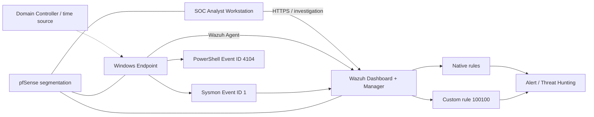
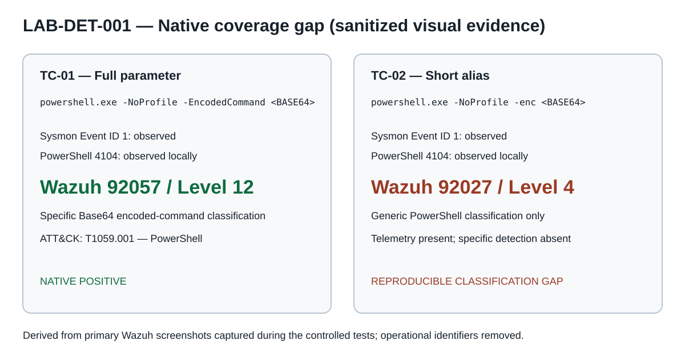
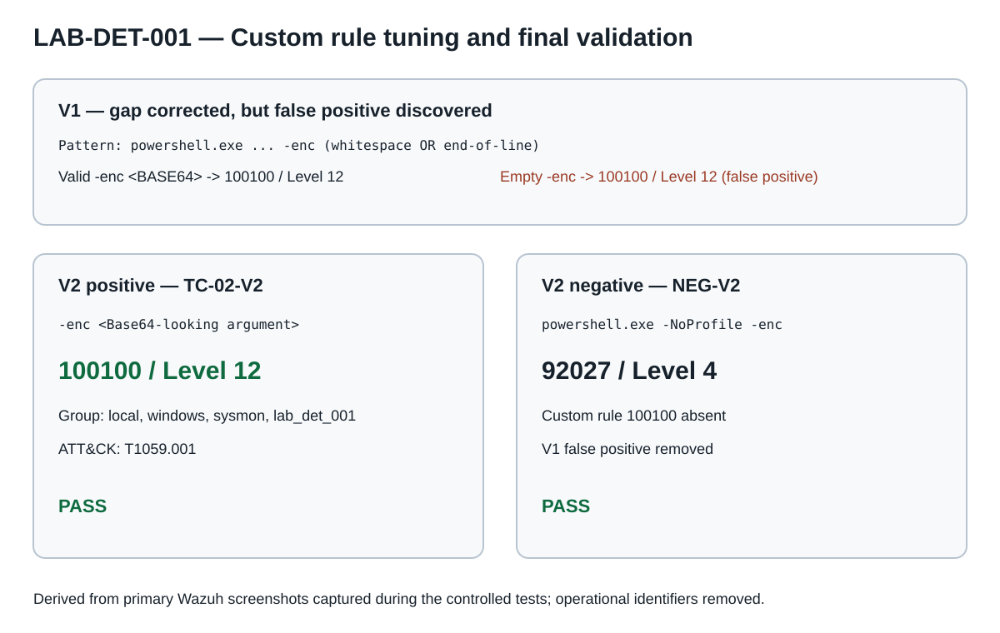

# SOC Detection Engineering

Practical detection engineering project built on a reusable SOC lab.

## LAB-DET-001 — PowerShell Encoded Execution

**Status: functionally validated and documented.**

This use case demonstrates a complete detection-engineering workflow with Windows PowerShell, Sysmon, and Wazuh.

The project does not stop at “the rule fired.” It documents:

- the original problem;
- the detection hypothesis;
- the architecture and telemetry path;
- the controlled baseline;
- the native coverage gap;
- root-cause analysis of the installed Wazuh rule;
- custom-rule design;
- a false positive introduced by V1;
- tuning to V2;
- final positive and negative revalidation;
- ATT&CK mapping;
- limitations and publication-safe evidence.

> **Start here:** [Complete LAB-DET-001 technical case study](docs/LAB-DET-001-case-study.md)

---

## Architecture



Detailed architecture: [docs/architecture.md](docs/architecture.md)

---

## Problem

Equivalent encoded PowerShell behavior was visible in endpoint telemetry but did not receive equivalent native Wazuh classification.

Controlled testing showed:

```text
-EncodedCommand <BASE64> -> native 92057 / level 12
-enc <BASE64>            -> native 92027 / level 4
```

The signal was present. The gap was in detection/classification logic.

---

## Root cause

The installed native Wazuh rule `92057` contained an encoded-command PCRE2 alternation that covered multiple parameter abbreviations but did **not** include the exact `enc` token.

Therefore:

```text
-EncodedCommand -> specific encoded-command detection
-enc            -> generic PowerShell detection
```

This conclusion was based on direct inspection of the rule deployed in the lab, not on assumption.

---

## Final engineering result

A dedicated custom rule `100100` was implemented without modifying the native Wazuh ruleset.

### V1

V1 corrected the original gap but also classified an empty `-enc` invocation as encoded-command execution.

That behavior was treated as a false positive.

### V2

The rule was tuned to require a Base64-looking argument after `-enc`.

Final observed behavior:

```text
valid -enc <BASE64> -> custom 100100 / level 12
empty -enc          -> native 92027 / level 4; custom 100100 absent
```

Final rule: [detection-rules/wazuh-rules.xml](detection-rules/wazuh-rules.xml)

---

## Visual evidence

### Native coverage gap



### Final custom-rule validation



Evidence provenance and manifest: [evidence/README.md](evidence/README.md)

The public visuals are sanitized derivatives of the primary Wazuh screenshots captured during the controlled tests. Raw screenshots are not published because they contain operational lab identifiers that are unnecessary for recruiter review.

---

## Validation matrix

| Test | Behavior | Observed Wazuh result | Result |
|---|---|---|---|
| TC-00 | normal PowerShell | `92027 / level 4` | baseline |
| TC-01 | `-EncodedCommand <BASE64>` | `92057 / level 12` | native positive |
| TC-02 | `-enc <BASE64>` before custom rule | `92027 / level 4` | gap reproduced |
| TC-02-R1 | valid `-enc <BASE64>` with V1 | `100100 / level 12` | positive |
| NEG-V1 | empty `-enc` with V1 | `100100 / level 12` | false positive |
| TC-02-V2 | valid `-enc <BASE64>` with V2 | `100100 / level 12` | PASS |
| NEG-V2 | empty `-enc` with V2 | `92027 / level 4`; no `100100` | PASS |

Full test documentation: [tests-or-validation/test-cases.md](tests-or-validation/test-cases.md)

---

## ATT&CK

**T1059.001 — Command and Scripting Interpreter: PowerShell**

The mapping is supported by the observed PowerShell process execution and Sysmon process-creation telemetry.

---

## Repository structure

```text
.
├── README.md
├── detection-rules/
│   └── wazuh-rules.xml
├── docs/
│   ├── LAB-DET-001-case-study.md
│   ├── architecture.md
│   ├── coverage-matrix.md
│   ├── limitations.md
│   ├── telemetry-analysis.md
│   ├── use-case-design.md
│   └── validation-plan.md
├── evidence/
│   ├── README.md
│   └── lab-det-001/
│       ├── native-gap-evidence.svg
│       └── final-validation-evidence.svg
├── samples/
│   └── sanitized-events.json
└── tests-or-validation/
    └── test-cases.md
```

---

## Engineering principles demonstrated

- Validate telemetry before writing detections.
- Distinguish visibility from detection quality.
- Establish a benign baseline.
- Compare native coverage before adding custom logic.
- Inspect deployed rules to identify root cause.
- Avoid modifying vendor/native rules directly.
- Back up before shared configuration changes.
- Validate syntax and service health.
- Use positive and negative tests.
- Treat false positives as engineering failures to tune, not as success.
- Publish only claims supported by observed evidence.

---

## Limitations

The final rule is validated against the controlled LAB-DET-001 test set only.

No production false-positive rate, enterprise-scale coverage, or universal PowerShell encoded-command detection is claimed.

See [docs/limitations.md](docs/limitations.md) for the complete limitations statement.
