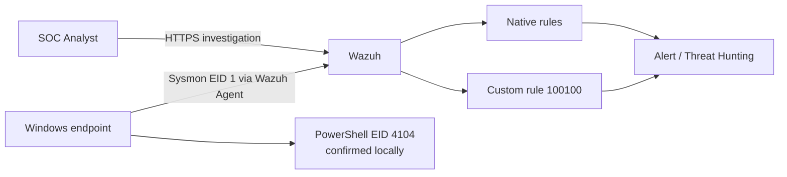

# SOC Detection Engineering

Practical detection engineering project built on a reusable SOC lab.

## LAB-DET-001 — PowerShell Encoded Execution

**Status:** V2 is functionally validated in the lab. Evidence hardening and broader V3 research are still in progress.

### Problem

A PowerShell encoded-command execution was visible in endpoint telemetry but the short `-enc` alias did not receive the same native Wazuh classification as `-EncodedCommand`.

```text
-EncodedCommand <BASE64> -> native rule 92057 / level 12
-enc <BASE64>            -> native rule 92027 / level 4
```

The signal existed; the gap was in detection/classification logic.

### What was engineered

- benign baseline before custom detection;
- native coverage comparison;
- direct inspection of Wazuh rule `92057`;
- custom rule `100100` without modifying vendor rules;
- V1 precision problem discovered during negative testing;
- V2 tuning and positive/negative revalidation;
- ATT&CK mapping to `T1059.001 — PowerShell`;
- version-sensitive environment record;
- sanitized real Wazuh alert sample;
- CI checks for XML well-formedness and the current PCRE2 contract.

> **Technical review:** [Complete LAB-DET-001 case study](docs/LAB-DET-001-case-study.md)

## Architecture



Detailed architecture: [docs/architecture.md](docs/architecture.md)

## Key evidence

- [Sanitized real TC-02 Wazuh alert JSON](evidence/lab-det-001/tc02-native-alert-sanitized.json)
- [Evidence provenance](evidence/README.md)
- [Canonical coverage matrix](docs/coverage-matrix.md)
- [Validation procedure](tests/test-cases.md)
- [Environment and versions](docs/environment.md)

The SVGs in `evidence/` are presentation summaries, not substitutes for primary evidence.

## Current rule

[detection-rules/wazuh-rules.xml](detection-rules/wazuh-rules.xml)

The rule intentionally keeps `parentImage = powershell.exe` to preserve parity with the native rule `92057` whose gap was being remediated. This narrows scope and does **not** claim coverage for PowerShell launched from other parents such as `cmd.exe`, WMI, or script hosts.

## Reproducibility

GitHub Actions validates:

- XML well-formedness;
- PCRE2 positive/negative contract cases for the current V2 regex.

These CI checks do not replace Wazuh's rule engine. Reproducible `wazuh-logtest` captures are still a pending evidence-hardening item.

## V3 research — not yet validated

Technical review identified a plausible broader prefix gap beyond exact `-enc`. The active V2 rule has **not** been replaced.

See [docs/v3-research-plan.md](docs/v3-research-plan.md) for the required endpoint and Wazuh validation before any V3 promotion.

## Repository map

```text
detection-rules/      final lab rule
docs/                 case study, architecture, environment, limitations, V3 plan
tests/                test procedures and PCRE2 contract tests
evidence/             provenance and sanitized evidence
samples/              sanitized representative data
.github/workflows/    automated XML/PCRE2 checks
```

## Resumen en español

LAB-DET-001 demuestra un ciclo real de Detection Engineering: partir de una hipótesis, comprobar telemetría, reproducir un gap nativo, identificar la causa en la regla instalada, diseñar una corrección reversible, detectar un problema de precisión en V1, ajustar V2 y revalidar con pruebas positivas y negativas.

No se presenta como cobertura universal de PowerShell ni como una métrica de falsos positivos de producción.

## Security / publication

Raw screenshots and logs containing operational identifiers are not published. Sanitized evidence is derived only from observations actually produced in the controlled SOC lab.
