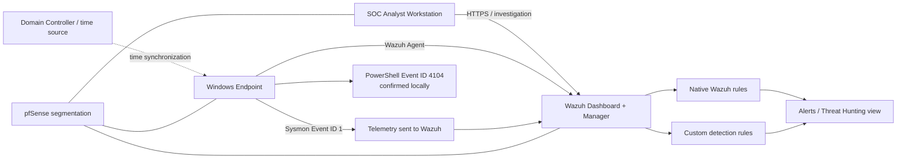

# LAB-DET-001 — PowerShell Encoded Execution Detection Engineering Case Study

> **Status:** V2 functionally validated in the controlled SOC lab; evidence hardening and V3 research remain open.  
> **Primary platform:** Wazuh + Sysmon + Windows PowerShell.  
> **ATT&CK:** T1059.001 — PowerShell.  
> **Final custom rule:** 100100 / level 12.

---

## 1. Executive summary

This use case started with a simple detection-engineering question:

**Does the native Wazuh ruleset classify equivalent PowerShell encoded-command executions consistently when the operator uses the full `-EncodedCommand` parameter versus the valid short alias `-enc`?**

The answer, in the tested lab state, was **no**.

The telemetry was present in both cases, but the native detection logic classified the short alias only as generic PowerShell activity. The investigation then moved through the full engineering cycle:

```text
problem
-> hypothesis
-> baseline
-> controlled activity
-> telemetry validation
-> native coverage comparison
-> root-cause inspection
-> custom rule V1
-> precision issue discovered
-> tuning V2
-> positive/negative revalidation
-> documentation
```

The final V2 custom rule detects `-enc` only when it is followed by a Base64-looking argument. It passed the final controlled positive and negative tests.

---

## 2. Architecture and scope

LAB-DET-001 reused the permanent SOC lab. No dedicated lab was created for this project.



### In-scope components

| Layer | Component | Role in LAB-DET-001 |
|---|---|---|
| Analyst | SOC Analyst workstation | Wazuh investigation and administration path |
| Endpoint | Windows endpoint | Controlled PowerShell execution |
| Endpoint telemetry | Sysmon | Process Creation — Event ID 1 |
| Endpoint telemetry | PowerShell Operational log | Script Block Logging — Event ID 4104 |
| SIEM/XDR | Wazuh | Ingestion, native rules, custom rules, alert validation |
| Identity/time | Domain controller | Endpoint time source during the test |
| Network | pfSense | Segmentation and lab routing |

### Explicitly out of scope

Security Onion was not required for this use case because the detection hypothesis was host/process based. The project intentionally reused the existing Wazuh endpoint telemetry rather than adding another pipeline.

---

## 3. Problem statement

A process can be visible in telemetry without being classified with the intended severity or detection context.

Windows PowerShell supports encoded command execution through the full `-EncodedCommand` parameter and valid abbreviated parameter names such as `-enc`.

The engineering problem was therefore:

> **If equivalent encoded PowerShell activity is visible in Sysmon, does Wazuh classify both `-EncodedCommand` and `-enc` as encoded-command execution, or can an abbreviation fall back to generic PowerShell coverage?**

This is not a telemetry-collection problem unless the endpoint data is missing. The project first had to prove whether the signal existed.

---

## 4. Detection hypothesis

### Hypothesis

A controlled PowerShell child process launched with an encoded command should:

1. generate Sysmon Event ID 1;
2. generate PowerShell Event ID 4104 locally;
3. have the Sysmon process-creation event reach Wazuh through the existing Windows event-channel pipeline;
4. use local PowerShell Event ID 4104 only as supporting endpoint evidence unless Wazuh ingestion of that exact test event is separately demonstrated;
5. receive equivalent encoded-command classification regardless of whether the command uses `-EncodedCommand` or `-enc`.

### Decision rule

If both variants generate the required telemetry but only one receives the specific encoded-command rule, the finding is a **detection/classification gap**, not a collection gap.

---

## 5. Preconditions validated before testing

The use case reused already-operational SOC infrastructure and performed focused current-state checks instead of rebuilding the lab.

The relevant conditions observed during this project were:

- the Windows endpoint Wazuh agent was running;
- the endpoint was sending current events to Wazuh;
- Sysmon Event ID 1 was observable;
- PowerShell Event ID 4104 was observable locally;
- Wazuh Dashboard/Manager was reachable from the analyst workstation;
- endpoint time synchronization was restored before the controlled tests;
- the Wazuh Manager was operational before any rule change.

No custom detection result was accepted until an exact event was attributed by timestamp and command line.

---

## 6. Test design

The project used benign payloads so that the test exercised detection logic without performing harmful actions.

### Base payload pattern

```powershell
$script = 'Write-Output "SOC-DETECTION-TEST-<CASE>"'
$encoded = [Convert]::ToBase64String(
    [Text.Encoding]::Unicode.GetBytes($script)
)
```

Windows PowerShell expects the encoded command as a Unicode/UTF-16LE byte representation before Base64 conversion.

### Test cases

| ID | Purpose | Controlled behavior |
|---|---|---|
| TC-00 | Benign baseline | PowerShell child process without encoded argument |
| TC-01 | Native positive | `-EncodedCommand <BASE64>` |
| TC-02 | Gap check | `-enc <BASE64>` |
| TC-02-R1 | Custom V1 positive | `-enc <BASE64>` after V1 rule |
| NEG-V1 | Precision-boundary check | `-enc` with no argument |
| TC-02-V2 | Final positive | `-enc <BASE64>` after V2 tuning |
| NEG-V2 | Final negative | `-enc` with no argument after V2 tuning |

---

## 7. Step 1 — establish a benign PowerShell baseline

### Controlled command

```powershell
powershell.exe -NoProfile -Command 'Write-Output "SOC-DETECTION-TEST-TC00"'
```

### Observed telemetry

- Sysmon Event ID 1: **yes**.
- PowerShell Event ID 4104 locally: **yes**.
- Sysmon Event ID 1 in Wazuh: **yes**.
- Wazuh result: **rule 92027 / level 4**.
- Native description: generic PowerShell process-spawn behavior.

### Engineering conclusion

Rule `92027` cannot be treated as evidence of encoded-command detection because the benign non-encoded baseline also triggers it.

This baseline is important: without it, a later `92027` result could be misinterpreted as successful encoded-command coverage.

---

## 8. Step 2 — test the full `-EncodedCommand` parameter

### Controlled execution

```powershell
powershell.exe -NoProfile -EncodedCommand $encoded
```

### Observed result

The command executed successfully and the controlled marker was returned.

The corresponding Wazuh event showed:

```text
Sysmon Event ID: 1
commandLine: powershell.exe -NoProfile -EncodedCommand <BASE64>
rule.id: 92057
rule.level: 12
ATT&CK: T1059.001
```

PowerShell Event ID 4104 was also observed locally for the controlled execution.

### Conclusion

Native Wazuh coverage correctly recognized the long-form encoded-command behavior.

**Evidence:** E1/E2 in the evidence section.

---

## 9. Step 3 — test the short `-enc` alias

The payload remained benign and equivalent in purpose. The relevant detection variable was the parameter form.

### Controlled execution

```powershell
powershell.exe -NoProfile -enc $encoded
```

### Observed result

The payload executed successfully.

The corresponding Wazuh event showed:

```text
Sysmon Event ID: 1
commandLine: powershell.exe -NoProfile -enc <BASE64>
rule.id: 92027
rule.level: 4
ATT&CK: T1059.001
```

PowerShell Event ID 4104 was also present locally.

### Engineering conclusion

The data was not missing.

```text
telemetry present
-> Sysmon sees -enc
-> PowerShell 4104 exists
-> Wazuh receives the Sysmon event
-> native encoded-command rule does not classify it
```

Therefore the finding was a **reproducible native classification gap**.

**Evidence:** E3/E4.

---

## 10. Step 4 — root-cause analysis

The next step was to inspect the actual installed Wazuh rule instead of guessing why TC-02 behaved differently.

### Read-only rule inspection

```bash
sudo grep -R -n -B 8 -A 12 'id="92057"' \
  /var/ossec/ruleset/rules \
  /var/ossec/etc/rules 2>/dev/null
```

### Relevant native condition observed

```xml
<field name="win.eventdata.commandLine" type="pcre2">
  (?i)powershell\.exe.+\-\b(encodedcommand|e|ea|ec|encodeda|encode|en|enco)\b
</field>
```

The tested native rule included multiple valid abbreviations but **did not include the exact `enc` token**.

### Root cause

```text
-EncodedCommand -> matches native rule 92057
-enc            -> does not match 92057
                  -> generic PowerShell rule 92027 wins
```

At this point the reason for the gap became **verified**, not hypothetical.

---

## 11. Step 5 — change design and safety controls

The native ruleset was not edited.

### Engineering decision

Create a dedicated custom rule under:

```text
/var/ossec/etc/rules/
```

instead of modifying the packaged Wazuh file under:

```text
/var/ossec/ruleset/rules/
```

### Pre-change safeguards

Before modifying Wazuh custom rules:

1. existing custom-rule files were enumerated;
2. existing rule IDs were checked;
3. only the default/example custom rule ID `100001` was present;
4. a dedicated ID `100100` was selected;
5. the entire custom-rules directory was backed up.

Backup performed:

```bash
sudo cp -a /var/ossec/etc/rules \
  /var/ossec/etc/rules.backup-LAB-DET-001-20261005
```

### Rollback

If the custom rule caused a problem:

- remove the LAB-DET-001 custom rule or restore the custom-rules backup;
- validate the ruleset;
- restart Wazuh Manager in a controlled manner;
- verify service state.

---

## 12. Step 6 — custom detection V1

### Goal

Detect the missing `-enc` path without changing native rule `92057`.

### V1 logic

```text
Sysmon Event ID 1
AND parentImage ends in powershell.exe
AND commandLine contains -enc followed by whitespace OR end-of-line
```

### V1 rule

The initial command-line expression was:

```regex
(?i)powershell\.exe.*\s-enc(?:\s|$)
```

### Configuration validation

Before operational testing:

```bash
sudo /var/ossec/bin/wazuh-analysisd -t
echo $?
```

Observed:

```text
exit code = 0
```

The manager was then restarted and verified:

```bash
sudo systemctl restart wazuh-manager
sudo systemctl is-active wazuh-manager
```

Observed:

```text
active
```

---

## 13. Step 7 — V1 positive result and precision issue discovery

### Positive

A valid `-enc <BASE64>` execution triggered:

```text
rule.id: 100100
rule.level: 12
rule.description:
LAB-DET-001: PowerShell spawned PowerShell using the -enc alias for encoded command execution
ATT&CK: T1059.001
```

So V1 solved the original detection gap.

### Negative behavior that exposed a defect

In a later PowerShell session, the variable holding the Base64 payload was not defined. The effective invocation became:

```powershell
powershell.exe -NoProfile -enc
```

PowerShell returned an error because no encoded argument was supplied.

However, V1 still generated:

```text
rule.id: 100100
rule.level: 12
```

### Engineering conclusion

V1 detected the token `-enc`, but did not prove the presence of an encoded argument.

This was treated as an **overbroad match / precision failure relative to the rule semantics**. The empty `-enc` invocation can still be suspicious operationally; the problem is that a rule claiming encoded-command execution should not assert that an encoded payload was present when it was not.

The rule was therefore not considered complete simply because it fired.

**Evidence:** E5.

---

## 14. Step 8 — tuning to V2

The regex was tightened so that `-enc` had to be followed by a Base64-looking token.

### Final V2 command-line expression

```regex
(?i)powershell\.exe.*\s-enc\s+[A-Za-z0-9+/]{8,}={0,2}(?:\s|$)
```

### What V2 changes

```text
-enc                         -> does not satisfy custom rule
-enc VwByAGkAdABl...         -> satisfies custom rule
```

The Base64 test is intentionally heuristic. It verifies shape, not successful decode semantics.

### Post-change validation

The ruleset was validated again:

```text
analysisd_exit=0
```

Wazuh Manager was restarted and returned:

```text
active
```

---

## 15. Step 9 — final V2 positive revalidation

### Controlled activity

```powershell
$script = 'Write-Output "SOC-DETECTION-TEST-TC02-V2"'
$encoded = [Convert]::ToBase64String(
    [Text.Encoding]::Unicode.GetBytes($script)
)
powershell.exe -NoProfile -enc $encoded
```

### Observed Wazuh result

```text
rule.id: 100100
rule.level: 12
rule.groups: local, windows, sysmon, lab_det_001
ATT&CK: T1059.001
```

**Result: PASS.**

**Evidence:** E6/E7.

---

## 16. Step 10 — final V2 negative revalidation

### Controlled negative

```powershell
powershell.exe -NoProfile -enc
```

PowerShell rejected the command because the argument was missing.

### Observed Wazuh result

```text
rule.id: 92027
rule.level: 4
rule.description: Powershell process spawned powershell instance
```

The custom rule `100100` was absent.

**Result: PASS.**

The overbroad V1 match was corrected.

**Evidence:** E8/E9.

---

## 17. Final rule

### Parent-process scope

The final rule retains the `parentImage = powershell.exe` condition intentionally because native rule `92057` uses the same parent constraint. LAB-DET-001 was designed as a narrow remediation of that specific native coverage gap, not as universal PowerShell process-launch detection.

This means launches from other parents such as `cmd.exe`, WMI, `wscript.exe`, or other process chains remain outside the validated scope and require separate use cases.

The portfolio copy of the final rule is stored in:

`detection-rules/wazuh-rules.xml`

Final logic:

```xml
<group name="local,windows,sysmon,lab_det_001,">
  <rule id="100100" level="12">
    <if_group>sysmon_event1</if_group>
    <field name="win.eventdata.parentImage" type="pcre2">(?i)\\powershell\.exe$</field>
    <field name="win.eventdata.commandLine" type="pcre2">(?i)powershell\.exe.*\s-enc\s+[A-Za-z0-9+/]{8,}={0,2}(?:\s|$)</field>
    <description>LAB-DET-001: PowerShell spawned PowerShell using the -enc alias for encoded command execution</description>
    <mitre>
      <id>T1059.001</id>
    </mitre>
  </rule>
</group>
```

---

## 18. Results and metrics

The authoritative result matrix is maintained in [coverage-matrix.md](coverage-matrix.md), and the execution procedures are maintained in [../tests/test-cases.md](../tests/test-cases.md).

For the final V2 acceptance pair only:

- positive cases executed: **1**;
- positive detections by rule 100100: **1**;
- negative precision cases executed: **1**;
- negative precision cases incorrectly classified by rule 100100: **0**.

These counts describe only that controlled acceptance pair. They are not a production false-positive rate.

---

## 19. ATT&CK mapping

### T1059.001 — Command and Scripting Interpreter: PowerShell

The mapping is supported by the observed execution of `powershell.exe` and the corresponding process-creation telemetry.

The rule does not claim broader PowerShell tradecraft coverage beyond the tested encoded-command alias behavior.

---

## 20. Evidence map

The primary evidence was captured directly from the controlled executions and Wazuh Document Details during the project.

| Evidence | What it proves |
|---|---|
| E1 | TC-01 command line contains `-EncodedCommand <BASE64>` |
| E2 | TC-01 native Wazuh classification = 92057 / level 12 / T1059.001 |
| E3 | TC-02 command line contains `-enc <BASE64>` |
| E4 | TC-02 native Wazuh classification = 92027 / level 4 |
| E5 | custom-rule operational timeline showing V1 behavior, including the overbroad precision test |
| E6 | final V2 positive command line contains `-enc <BASE64>` |
| E7 | final V2 positive classification = 100100 / level 12 / T1059.001 |
| E8 | final V2 negative command line ends at `-enc` with no payload |
| E9 | final V2 negative classification = 92027 / level 4; custom 100100 absent |

The evidence folder includes presentation summaries plus a sanitized JSON derived from the real TC-02 `alerts.json` record. The SVGs are not presented as primary technical evidence.

For the final V2 positive (E6/E7), a sanitized copy of the real alert document and three redacted Wazuh screenshots are also published in `evidence/lab-det-001/`. Raw screenshots remain outside the public repository because they contain operational lab metadata. Reproducible `wazuh-logtest` captures are still pending and are explicitly tracked as evidence hardening rather than silently claimed as complete.

---

## 21. Limitations

The project deliberately avoids claims that were not measured.

- The rule was validated against a small controlled test set, not enterprise-scale production traffic.
- No production false-positive rate is claimed.
- Event-to-alert latency was not measured with a repeatable sample set.
- The Base64 pattern is syntactic/heuristic; it does not decode the value.
- The rule targets the exact `-enc` alias. A broader V3 prefix hypothesis is documented but not validated.
- The parent process condition requires `powershell.exe`; this is intentional parity with native rule 92057, not a claim that other parent processes are benign.
- The final Wazuh detection is based on Sysmon Event ID 1; local 4104 presence supports telemetry analysis but is not part of custom rule logic.
- Future Wazuh ruleset updates must be reviewed because native coverage may change and make the custom rule redundant.

---

## 22. Detection Engineering Definition of Done

LAB-DET-001 satisfies the project-level functional requirements demonstrated in this lab:

- problem defined before rule implementation;
- controlled telemetry verified;
- native coverage tested;
- gap reproduced;
- root cause identified from actual configuration;
- custom rule implemented without modifying native rules;
- rollback available;
- rule validation successful;
- positive test passed;
- negative test passed;
- overbroad precision match found and tuned;
- ATT&CK mapping documented;
- limitations documented;
- sanitized evidence prepared for portfolio review;
- remaining evidence-hardening work (`wazuh-logtest`) and V3 research are explicitly tracked as pending.

---

## 23. Recruiter / technical-review takeaway

LAB-DET-001 is not presented as “I wrote a regex that fired.”

It demonstrates the ability to:

- distinguish telemetry visibility from detection quality;
- build a controlled test matrix;
- validate native SIEM coverage before adding rules;
- inspect the real detection logic to find root cause;
- make a reversible Wazuh change;
- identify an overbroad precision match introduced by the first implementation;
- tune the rule using observed behavior;
- perform positive and negative revalidation;
- document what was proven and what was not.

That engineering process is the primary deliverable of this use case. Environment/version details are recorded in [environment.md](environment.md), and unvalidated V3 work is isolated in [v3-research-plan.md](v3-research-plan.md).
