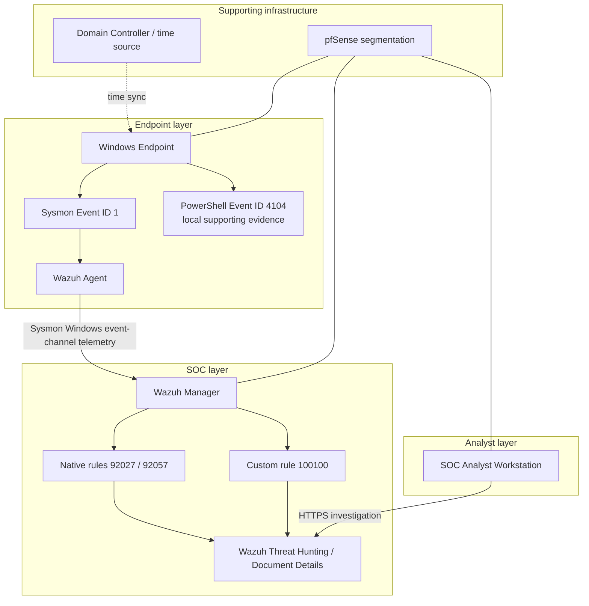

# LAB-DET-001 Architecture

## Detection path



## Data flow used by the detection

```text
controlled PowerShell activity
-> Windows process creation
-> Sysmon Event ID 1
-> Wazuh Agent
-> Wazuh Manager
-> native/custom rule evaluation
-> alert
-> analyst validation
```

PowerShell Event ID 4104 was independently confirmed **locally** during the controlled tests. LAB-DET-001 does not claim that the exact 4104 test events were ingested into Wazuh.

## Parent-process design scope

The custom rule keeps the `parentImage = powershell.exe` condition to maintain parity with native Wazuh rule `92057`, which uses the same parent constraint.

This is a deliberate scope boundary. It leaves PowerShell executions launched from other parents outside LAB-DET-001 and avoids presenting the rule as universal PowerShell encoded-command coverage.

## Scope decision

Security Onion was intentionally not introduced because the detection question was endpoint/process based and the permanent SOC lab already provided the required Sysmon signal through Wazuh.
